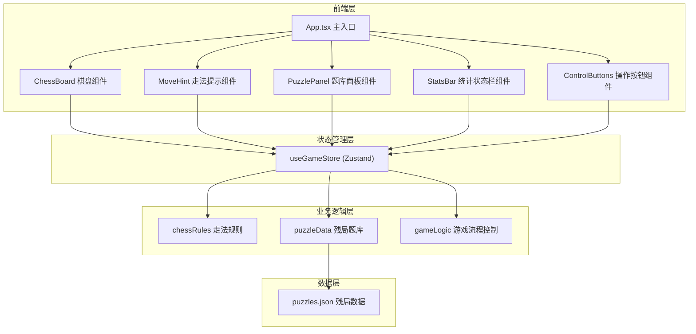
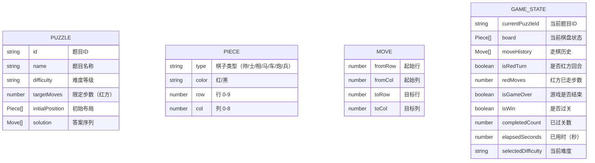

## 1. 架构设计



## 2. 技术描述
- 前端：React@18 + TypeScript + Vite
- 样式：TailwindCSS@3
- 状态管理：Zustand
- 图标：lucide-react
- 后端：无（纯前端应用）
- 数据库：无（残局数据内置为 JSON）

## 3. 路由定义
| 路由 | 用途 |
|------|------|
| / | 主练习页面（唯一页面） |

## 4. 数据模型

### 4.1 数据模型定义



### 4.2 残局数据结构示例

```json
{
  "id": "puzzle_001",
  "name": "马后炮",
  "difficulty": "beginner",
  "targetMoves": 3,
  "initialPosition": [
    {"type": "帅", "color": "red", "row": 9, "col": 4},
    {"type": "炮", "color": "red", "row": 7, "col": 4},
    {"type": "马", "color": "red", "row": 7, "col": 2},
    {"type": "将", "color": "black", "row": 0, "col": 4}
  ],
  "solution": [
    {"fromRow": 7, "fromCol": 2, "toRow": 5, "toCol": 3},
    {"fromRow": 0, "fromCol": 4, "toRow": 0, "toCol": 5},
    {"fromRow": 7, "fromCol": 4, "toRow": 0, "toCol": 4}
  ]
}
```

## 5. 核心模块说明

### 5.1 组件划分
- **ChessBoard.tsx**：棋盘渲染，处理棋子点击和位置点击
- **Piece.tsx**：单个棋子渲染
- **MoveHint.tsx**：合法走法高亮提示
- **PuzzlePanel.tsx**：题库面板，难度切换和题目选择
- **StatsBar.tsx**：统计信息展示
- **ControlButtons.tsx**：悔棋、重置、答案、下一题按钮

### 5.2 工具函数
- **chessRules.ts**：各类棋子走法规则、将死检测、合法性校验
- **gameLogic.ts**：游戏流程控制、AI应答、胜负判断
- **puzzleData.ts**：残局题库加载和管理

### 5.3 状态管理
- **useGameStore.ts**：Zustand store，管理全局游戏状态
