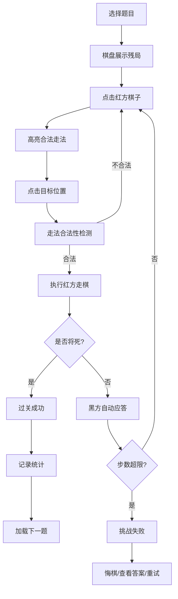

## 1. 产品概述

中国象棋残局练习工具，帮助象棋爱好者通过经典残局谜题提升杀法能力。内置分级残局题库，红方先行，限定步数内将死黑方。

- 目标用户：象棋初学者到中级水平的爱好者
- 核心价值：通过针对性的残局训练，快速提升实战杀棋能力

## 2. 核心功能

### 2.1 用户角色
| 角色 | 注册方式 | 核心权限 |
|------|----------|----------|
| 普通用户 | 无需注册 | 使用全部练习功能、查看统计数据 |

### 2.2 功能模块
1. **主练习页面**：棋盘展示、残局信息、走棋操作
2. **题库面板**：难度分级、题目列表、进度显示
3. **统计面板**：过关数、用时记录、当前题目信息

### 2.3 页面详情
| 页面名称 | 模块名称 | 功能描述 |
|----------|----------|----------|
| 主练习页面 | 棋盘组件 | 展示残局局面，支持点击棋子、点击目标位置走棋 |
| 主练习页面 | 走法提示组件 | 高亮显示合法走法位置，提示当前步数 |
| 主练习页面 | 题库面板组件 | 按难度分级展示题目列表，支持切换题目 |
| 主练习页面 | 操作按钮区 | 悔棋、重置、显示答案、下一题按钮 |
| 主练习页面 | 统计信息区 | 显示已过关数、当前用时、题目难度、限定步数 |

## 3. 核心流程

用户选择难度和题目 → 棋盘展示残局 → 点击红方棋子 → 高亮显示合法走法 → 点击目标位置走棋 → 黑方自动按题库答案回应 → 判断是否在限定步数内将死 → 成功则记录过关并加载下一题 / 失败可悔棋重试或查看答案

## 4. 用户界面设计

### 4.1 设计风格
- 主色调：古典棋盘木色（深棕色 #8B4513）+ 象牙白（米黄色 #F5DEB3）
- 点缀色：朱砂红（#C41E3A）、墨黑（#1A1A1A）、翡翠绿（#2E8B57）
- 按钮风格：圆角矩形，带轻微阴影，悬停有上浮效果
- 字体：标题用古朴衬线字体，正文用清晰易读的无衬线字体
- 布局：左棋盘右面板的经典布局，棋盘居中突出
- 视觉效果：棋盘带木纹质感，棋子有立体阴影，合法走法用半透明绿点提示

### 4.2 页面设计概述
| 页面名称 | 模块名称 | UI元素 |
|----------|----------|----------|
| 主练习页面 | 棋盘组件 | 10×9网格，楚河汉界，木纹背景，棋子用汉字+颜色区分 |
| 主练习页面 | 走法提示组件 | 选中棋子高亮边框，合法位置绿色圆点，可走位置轻微放大 |
| 主练习页面 | 题库面板组件 | 难度选项卡（入门/初级/中级/高级），题目列表带完成状态标记 |
| 主练习页面 | 操作按钮区 | 悔棋↶、重置⟲、答案💡、下一题→，统一尺寸图标按钮 |
| 主练习页面 | 统计信息区 | 数字卡片展示过关数、计时器、当前步数/限定步数 |

### 4.3 响应式
- 桌面端优先：左棋盘右面板双栏布局
- 平板端：棋盘在上，面板在下的单栏布局
- 移动端：棋盘自适应宽度，面板可折叠
- 触摸优化：棋子点击区域≥44px，按钮间距充足
